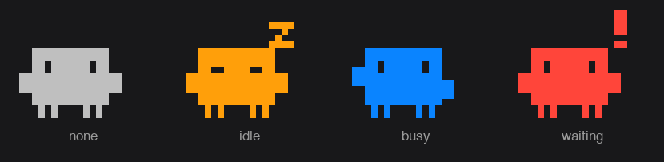

# Statusbar for Claude Code



A tiny macOS menu bar app that shows the live status of your **Claude Code
background sessions** as a single pixel-art icon, color-coded by state.

| State | Color | Meaning |
|-------|-------|---------|
| `waiting` | 🔴 red    | act now — a session is waiting for your input |
| `busy`    | 🔵 blue   | all good — sessions are actively working |
| `idle`    | 🟠 orange | sessions exist but nobody is doing anything |
| none      | ⚪️ gray   | no background sessions |

Priority is top-down: any `waiting` → red; else any `busy` → blue; else
any `idle` → orange. Warm colors mean "do something", blue means "running" —
think CI pipeline, not traffic light.

No text, no network, no auth, no dependencies — just the icon. Click it for a
per-state count breakdown and a Quit option.

> ⚠️ **Unofficial.** Not affiliated with or endorsed by Anthropic. The default
> icon resembles the Claude Code launch character; see *Customizing the icon*
> to replace it.

## How it works

There is **no network fetch**. Claude Code maintains a local registry of its
sessions at `~/.claude/sessions/*.json`, one JSON file per session, e.g.:

```json
{ "kind": "bg", "status": "busy", "pid": 10755 }
```

Every 2.5 s the app re-reads those files (a few tiny local reads — negligible
CPU/power), keeps `kind == "bg"` entries whose `pid` is still alive
(`kill(pid, 0)`), tallies them by `status`, and recolors the icon. It's polling,
not push, but a 2.5 s delay reads as real-time.

That is the entire permission story: **read access to `~/.claude/sessions/` is
all it needs**. No API key, no login, no Anthropic account — there is no server
to authenticate against, and nothing ever leaves your machine. (Liveness is
checked with `kill(pid, 0)`, a no-op signal that needs no privileges for your
own processes.)

> ⚠️ This relies on Claude Code's **undocumented** session-registry format. An
> update to Claude Code could change the path or schema and break this tool.

## Requirements

- macOS 12+
- Xcode Command Line Tools (`xcode-select --install`) — provides `swiftc`

No third-party libraries; it links only against the system Cocoa framework.

## Build & run

```bash
git clone <your-fork-url> statusbar-for-claude-code
cd statusbar-for-claude-code
./build.sh           # produces StatusbarForClaudeCode.app
open StatusbarForClaudeCode.app
```

## Start at login

```bash
./install-autostart.sh     # registers a LaunchAgent, runs at login
./uninstall-autostart.sh    # removes it
```

After editing the source: `./build.sh` then
`launchctl kickstart -k gui/$(id -u)/io.github.statusbar-for-claude-code`.

## Customizing the icon

The icon is a dot matrix of `#` (filled) and `.` (transparent). Override the
built-in one without touching code by providing your own:

- set `STATUSBAR_FOR_CLAUDE_CODE_CHAR=/path/to/char.txt`, **or**
- create `~/.config/statusbar-for-claude-code/char.txt`

`char.txt` is just rows of `#` and `.`, all the same length, e.g.:

```
.####.
#.##.#
######
#.##.#
.#..#.
```

The whole shape is filled with the current state color. Size and colors live
near the top of `main.swift` (`pixelCharIcon` height arg, and the `State.color`
mapping).

## Distribution note

This repo distributes **source**, not a signed binary. A prebuilt unsigned
`.app` would be blocked by Gatekeeper on other Macs. Shipping a notarized binary
requires an Apple Developer account; building from source sidesteps that.

## License

MIT — see [LICENSE](LICENSE).
